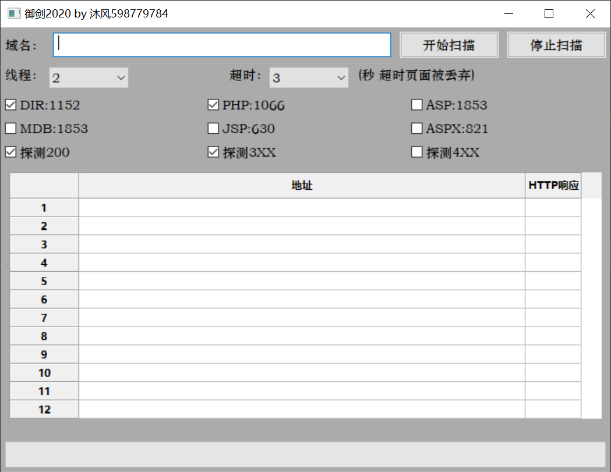

# 御剑2020 

### 介绍

- #### 后台扫描工具

- #### 支持版本: 3.x

### 下载安装

- 下载源码:

```
git clone git@github.com:ecithy/bg_scan.git
或者直接到https://codeload.github.com/ecithy/bg_scan/zip/master 下载zip文件
```

- 安装依赖:

```
pip install -r requirements.txt
```

-   启动:

```
python run.py
```



